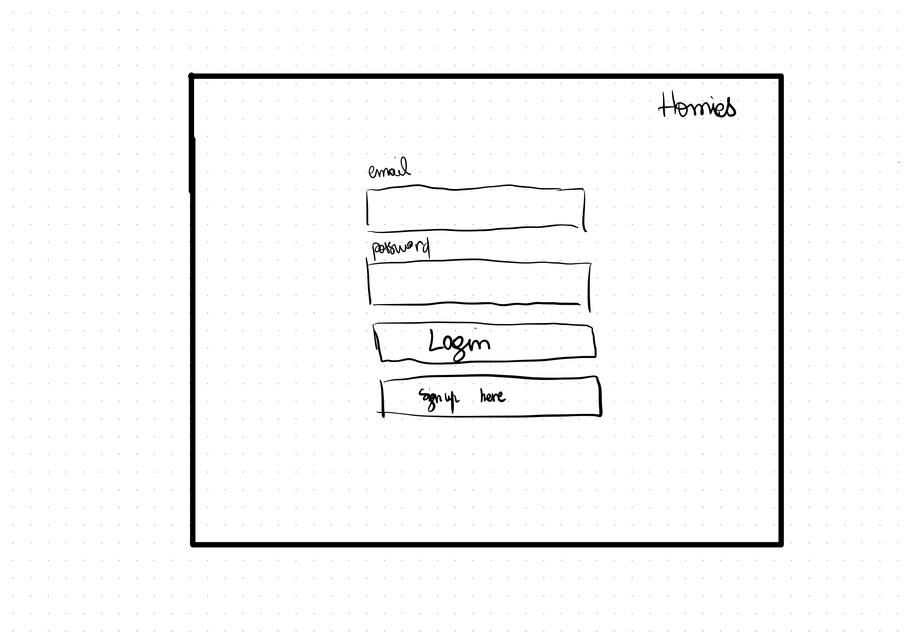
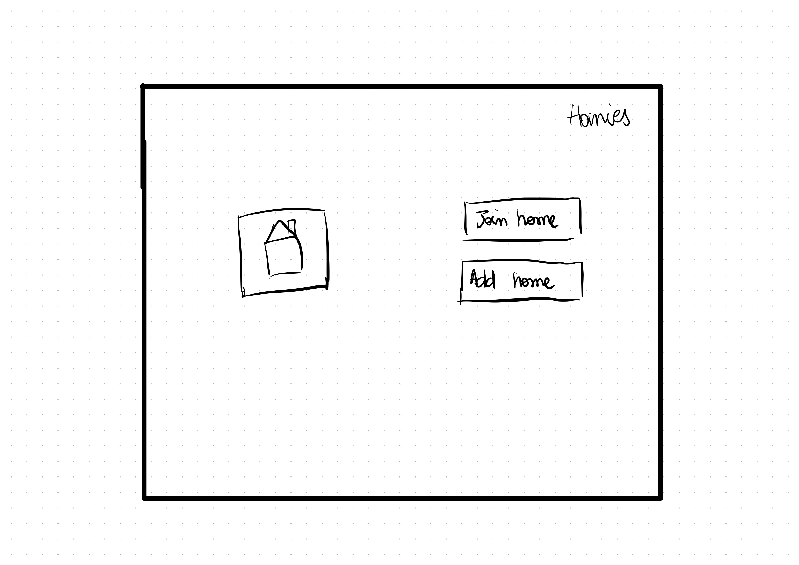
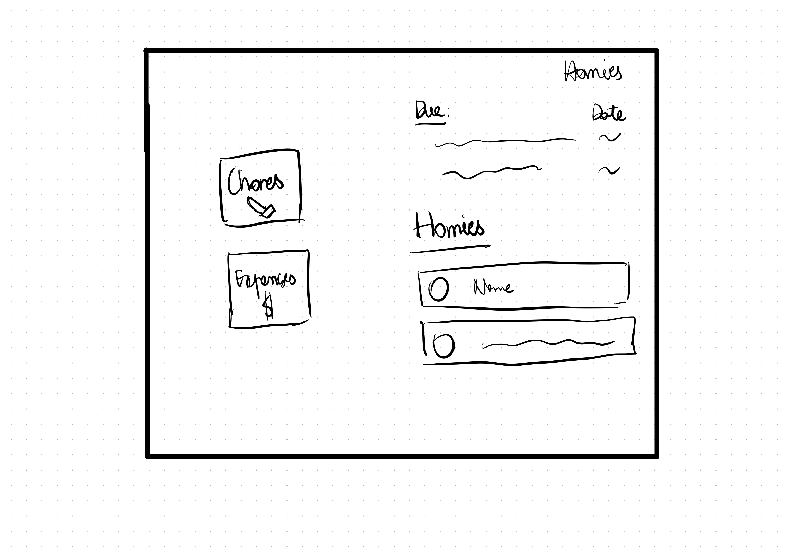
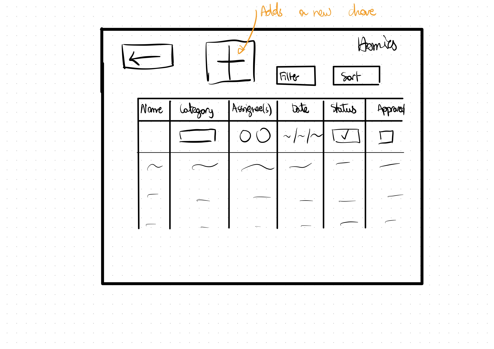
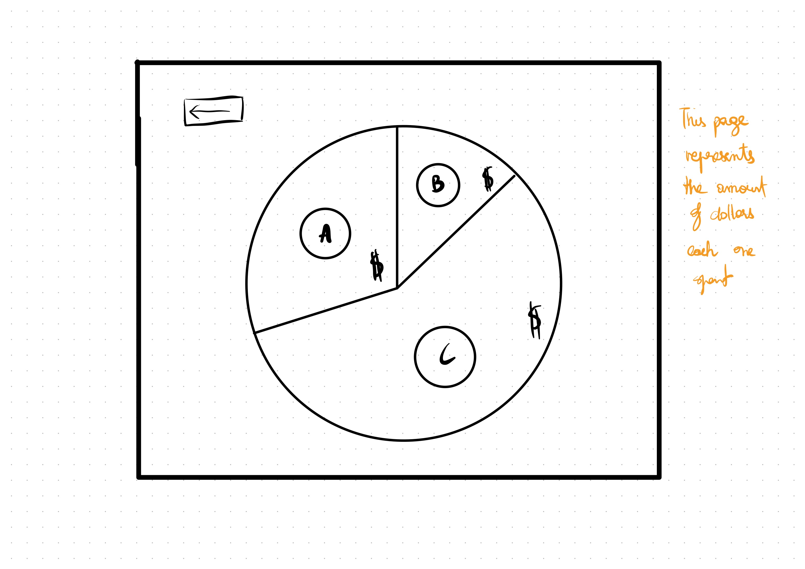
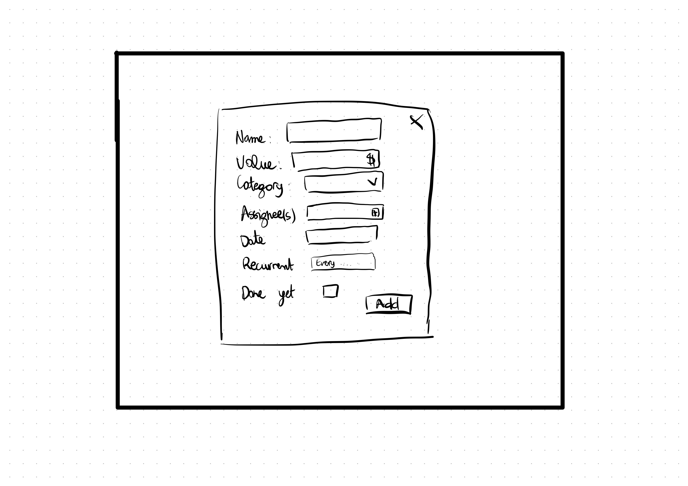
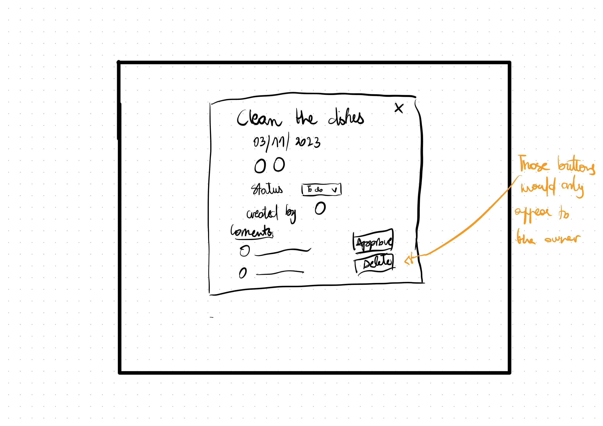
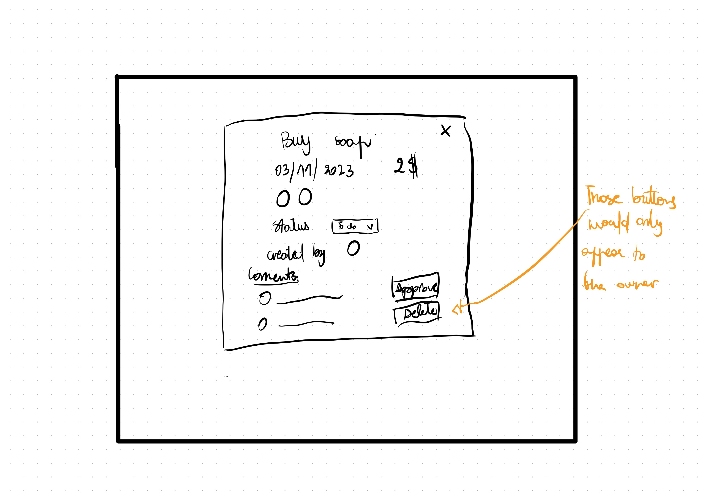
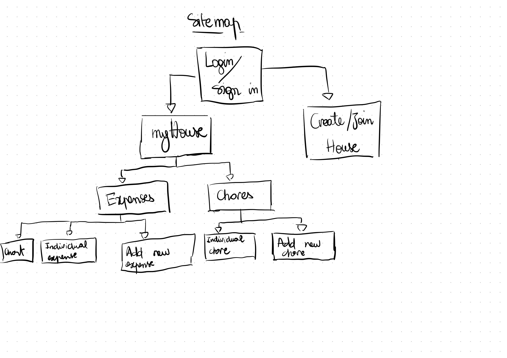

# Homies 

## Overview

As the saying goes "good accounts make good friends", well for the purpose of this we would like to change it to "good accounts make good roommates". In big metropolitan areas around the world, more people are moving in with roommates. However, most of the time this ends up in dispute over trivial stuff such as throwing the trash, cleaning dishes, buying dish soap...

Homies is a web app that allows roommates to keep track of every roommates chores and expenses relating to the house as well as assign some to people. This app would dimish conflict within the house and keep everyone accountable.


## Data Model

The application will store Users, Houses, Chores and Expenses.

* users can be part of a house (via references)
* each house has one chores list and expense list (by embedding)

An Example User:

```javascript
{
  givenName: "John",
  lastName: "Doe",
  email: "johndoe@email.com",
  hash: // a password hash,
  house: // a reference to a house
  profilePhoto: // a reference to profile photo
  _id: // user id 
}
```

An Example House with Embedded Chores and Embedded Expenses:

```javascript
{
  users: // a list of references to Users in the house
  name: "208, Howard Ave",
  chores: [
    { 
      name: "clean dishes", 
      date: "03/11/2023", 
      category: "CLEANING",
      assignee: // a list of references to Users,
      status: false,
      approved: false,
      owner: // reference to User that created 
      _taskid: // task id
    },
    { 
      name: "Throw the trash", 
      date: "03/12/2023", 
      category: "CLEANING",
      assignee: // a list of references to Users,
      status: true,
      approved: false,
      owner: // reference to User that created 
      _taskid: // task id
    }
  ],
  expenses:[
    { 
      name: "dish soap", 
      date: "03/11/2023", 
      category: "CLEANING",
      value: 2,
      assignee: // a list of references to Users,
      status: false,
      approved: false,
      owner: // reference to User that created 
      _taskid: // task id
    },
    { 
      name: "trash bags", 
      date: "03/12/2023", 
      category: "CLEANING",
      value: 5,
      assignee: // a list of references to Users,
      status: true,
      approved: false,
      owner: // reference to User that created 
      _taskid: // task id
    }
  ],
  _houseId: // House id
}
```


## [Link to Commented First Draft Schema](homies-backend/db.mjs) 

## Wireframes

/login - page to login or sign up


/home - home page


/house - house page


/chores - chores page

/expenses - expenses page

/expenses/chart - chart of everyone's expenses

/chores/new - form for creating new chore

/expenses/new - form for creating new expenses

/chore?id= - each individual chore page

/expense?id= - each individual expense page


## Site map



## User Stories or Use Cases

1. as non-registered user, I can register a new account with the site
2. as a user, I can log in to the site
3. as a user, I can create or join a new house 
4. as a user, I can see all the chores that have been assigned.
5. as a user, I can see all the expenses that have been assigned.
6. as a user, I can filter through the chores so that I can see specifically what I want
7. as a user, I can filter through the expenses so that I can see specifically what I want
8. As a user, I want to comment in the chore page or the expense page.
9. As the owner of the chore or expense page, I want to be able to approve whether someone finished the task.
10. As a user, I want to be able to change the status of a task.
11. As a user, I want to be able to see a chart of how much money everyone contributed.
12. As the owner of a task, I want to be able to delete it.
## Research Topics

* (5 points) Integrate user authentication
  *  So that users can login and create accounts
  *  passport js is a candidate
* (4 points) Perform client side form validation using a JavaScript library
* (6 points) React.js
  * Front-end framework
  * It's the most used in the industry, which says a lot about it's usability
* (2 points) vite
  * faster development experience

17 points total out of 8 required points

## [Link to Initial Main Project File](homies-backend/app.mjs) 

## Annotations / References Used
[vite video tutorial](https://www.youtube.com/watch?v=KCrXgy8qtjM) - helped me set up vite