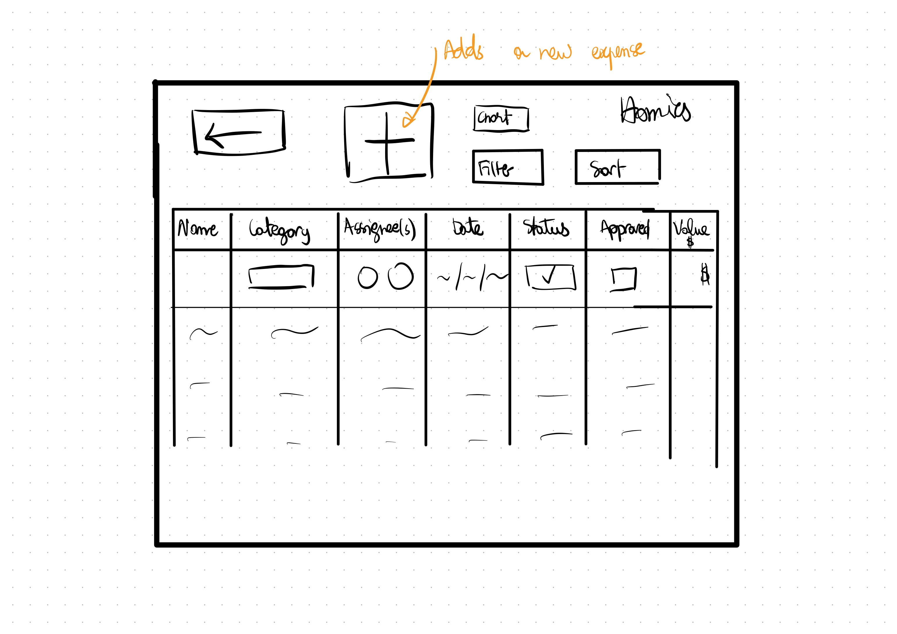
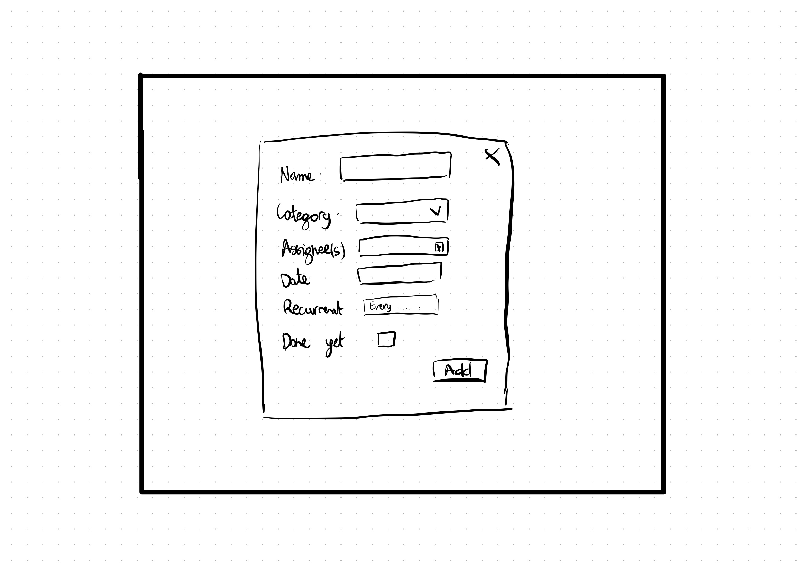

# Homies 

## Overview

As the saying goes "good accounts make good friends", well for the purpose of this we would like to change it to "good accounts make good roommates". In big metropolitan areas around the world, more people are moving in with roommates. However, most of the time this ends up in dispute over trivial stuff such as throwing the trash, cleaning dishes, buying dish soap...

Homies is a web app that allows roommates to keep track of every roommates chores and expenses relating to the house as well as assign some to people. This app would dimish conflict within the house and keep everyone accountable.


## Data Model

The application will store Users, Houses, Chores and Expenses.

* users can be part of a house (via references)
* each house has one chores list and expense list (by embedding)

An Example User:

```javascript
{
  givenName: "John",
  lastName: "Doe",
  email: "johndoe@email.com",
  hash: // a password hash,
  house: // a reference to a house
  profilePhoto: // a reference to profile photo
  _id: // user id 
}
```

An Example House with Embedded Chores and Embedded Expenses:

```javascript
{
  users: // a list of references to Users in the house
  name: "208, Howard Ave",
  chores: [
    { 
      name: "clean dishes", 
      date: "03/11/2023", 
      category: "CLEANING",
      assignee: // a list of references to Users,
      status: false,
      approved: false,
      owner: // reference to User that created 
      _taskid: // task id
    },
    { 
      name: "Throw the trash", 
      date: "03/12/2023", 
      category: "CLEANING",
      assignee: // a list of references to Users,
      status: true,
      approved: false,
      owner: // reference to User that created 
      _taskid: // task id
    }
  ],
  expenses:[
    { 
      name: "dish soap", 
      date: "03/11/2023", 
      category: "CLEANING",
      value: 2,
      assignee: // a list of references to Users,
      status: false,
      approved: false,
      owner: // reference to User that created 
      _taskid: // task id
    },
    { 
      name: "trash bags", 
      date: "03/12/2023", 
      category: "CLEANING",
      value: 5,
      assignee: // a list of references to Users,
      status: true,
      approved: false,
      owner: // reference to User that created 
      _taskid: // task id
    }
  ],
  _houseId: // House id
}
```


## [Link to Commented First Draft Schema](db.mjs) 

## Wireframes

(__TODO__: wireframes for all of the pages on your site; they can be as simple as photos of drawings or you can use a tool like Balsamiq, Omnigraffle, etc.)

/login - page to login or sign up


/home - home page


/house - house page


/chores - chores page

/expenses - expenses page

/expenses/chart - chart of everyone's expenses

/chores/new - form for creating new chore

/expenses/new - form for creating new expenses

/chore?id= - each individual chore page

/expense?id= - each individual expense page


## Site map


## User Stories or Use Cases

(__TODO__: write out how your application will be used through [user stories](http://en.wikipedia.org/wiki/User_story#Format) and / or [use cases](https://en.wikipedia.org/wiki/Use_case))

1. as non-registered user, I can register a new account with the site
2. as a user, I can log in to the site
3. as a user, I can create a new grocery list
4. as a user, I can view all of the grocery lists I've created in a single list
5. as a user, I can add items to an existing grocery list
6. as a user, I can cross off items in an existing grocery list

## Research Topics

(__TODO__: the research topics that you're planning on working on along with their point values... and the total points of research topics listed)

* (5 points) Integrate user authentication
    * I'm going to be using passport for user authentication
    * And account has been made for testing; I'll email you the password
    * see <code>cs.nyu.edu/~jversoza/ait-final/register</code> for register page
    * see <code>cs.nyu.edu/~jversoza/ait-final/login</code> for login page
* (4 points) Perform client side form validation using a JavaScript library
    * see <code>cs.nyu.edu/~jversoza/ait-final/my-form</code>
    * if you put in a number that's greater than 5, an error message will appear in the dom
* (5 points) vue.js
    * used vue.js as the frontend framework; it's a challenging library to learn, so I've assigned it 5 points

10 points total out of 8 required points (___TODO__: addtional points will __not__ count for extra credit)


## [Link to Initial Main Project File](app.mjs) 

(__TODO__: create a skeleton Express application with a package.json, app.mjs, views folder, etc. ... and link to your initial app.mjs)

## Annotations / References Used

(__TODO__: list any tutorials/references/etc. that you've based your code off of)

1. [passport.js authentication docs](http://passportjs.org/docs) - (add link to source code that was based on this)
2. [tutorial on vue.js](https://vuejs.org/v2/guide/) - (add link to source code that was based on this)

